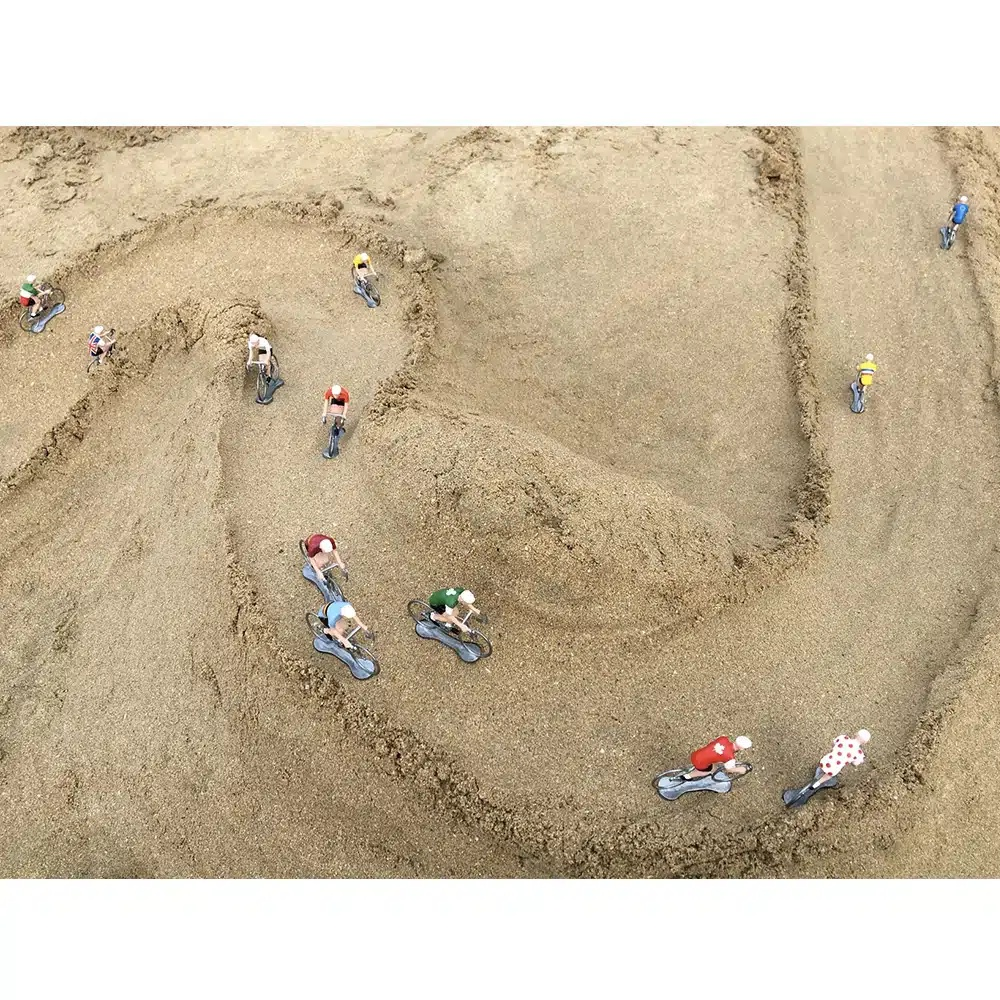
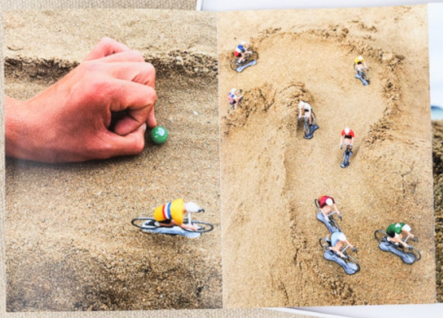
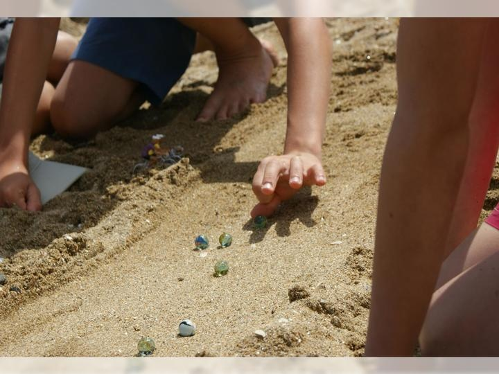

# Tour de Sable — Full Project Context

## Reference Photos

These are photos of the original physical game that inspired Tour de Sable.

| | |
|---|---|
|  |  |
| Metal cyclist figurines navigating a hand-built sand hill — the original toys. | Aerial view of a full sand circuit with S-curves carved by hand. Shows the course shape and scale we're recreating. |
|  |  |
| The marble is flicked with fingers to push the cyclist forward — the core mechanic. | Children playing the original game: marbles in a narrow carved sand channel, exactly the interaction the digital flick replicates. |

This document is a handoff brief for any agent, model, or developer picking up this project cold. It covers the origin concept, every major architectural decision and why it was made, current tuning state, known issues, and the roadmap.

---

## 1. Origin & Concept

**Tour de Sable** ("Tour of Sand") is a digital recreation of a game the creator played as a child on the beaches of Brittany, France. The original game used real glass marbles to represent Tour de France cyclists moving along a sand track carved by hand with shovels. Players took turns flicking their marble forward. The marble's travel distance and direction determined how far your cyclist advanced. The first to reach the finish won.

The digital version preserves this turn-based flick mechanic but renders the world in 3D with real physics. The "marble" is still the physics primitive under the hood (a ball collider), but the visual is a stylized low-poly cyclist figurine. The sand course is procedurally generated and themed after real Breton beach locations.

**Tone:** casual, tactile, nostalgic. Not a simulation — a toy. The feel of sand drag, the unpredictability of bumps and curves, the satisfaction of a perfect flick.

---

## 2. Tech Stack

| Layer | Technology |
|-------|-----------|
| Framework | Next.js 15 (App Router), TypeScript |
| 3D rendering | React Three Fiber (R3F) + Three.js |
| Physics | Rapier via `@react-three/rapier` |
| Styling | Tailwind CSS |
| Tests | Vitest |
| Hosting | Vercel (target: `tourdesable.amaurymarque.com`) |

No backend. No database. No assets — all geometry is built from Three.js primitives; all audio is procedural WebAudio.

---

## 3. Repository Structure

```
src/
  app/              Next.js App Router (page.tsx mounts GameCanvas)
  game/             Pure headless simulation — zero DOM, zero Three.js
    constants.ts    Single source of truth for all tuning values
    types.ts        Shared TypeScript interfaces
    rng.ts          Mulberry32 deterministic seeded RNG
    vector.ts       Lightweight 2D vector math (add, sub, dot, lerp…)
    track.ts        Procedural course generation + heightAt() terrain
    surface.ts      Per-frame sand material engine (damping, grain, trails)
    engine.ts       Turn resolution, off-course detection, trail recording
    stateMachine.ts Phase transitions: lobby → race → victory
  render3d/         React Three Fiber scene components
    Scene.tsx       Root scene: Physics world, lighting, env planes, input
    Terrain.tsx     Heightfield visual mesh + Rapier TrimeshCollider
    Racers3D.tsx    Active cyclist RigidBody + idle figurine rendering
    Cyclist.tsx     Low-poly cyclist built entirely from R3F primitives
    OrbitCamera.tsx Orbit camera with arrow-key pan + smart recenter
    Rocks3D.tsx     Rock obstacle visuals and BallColliders
    Trails3D.tsx    Persistent carved-channel trail rendering
    DirectionArrow  Heading indicator over the active cyclist
    FinishBeacon    Animated goal marker at the end of the course
  components/       React UI
    GameCanvas.tsx  Master controller: game loop, state, bot AI, input
    LobbyVote.tsx   Map selection screen with difficulty cards
    HUD.tsx         In-race scoreboard and turn indicator
    EscMenu.tsx     Pause overlay: sound toggle, volume, reset, lobby
  audio/
    audio.ts        Procedural WebAudio (no audio files on disk)
```

**Key architectural rule:** `src/game/` has zero dependencies on React, Three.js, or the DOM. All physics logic, AI decisions, and state transitions are pure functions or plain classes. This makes them fast to test and easy to reason about in isolation. React and R3F are a thin shell around this core.

---

## 4. Coordinate System

- **+Z** = forward along the course (start near z=0, finish near z=190)
- **+X** = cross-course (left/right)
- **+Y** = up
- `racer.pos` is a `Vector2D` where `.x` = world X and `.y` = world Z (not screen Y). This is because the game logic layer pre-dates the 3D renderer and uses 2D ground-plane coordinates.

---

## 5. Game Flow

```
Lobby (LobbyVote)
  → player picks a map theme + seed
  → generateTrack(seed, theme) builds the course deterministically

Race (GameCanvas + Scene)
  → turns cycle through racers in order (human first, then 3 bots)
  → Human turn:
      1. inPhysics = false — cyclist pinned at spawn, player aims
      2. Player drags back from cyclist (slingshot) → releases
      3. inPhysics = true — BallCollider launched with impulse
      4. Physics runs until settle (speed < SLEEP_SPEED for SETTLE_FRAMES)
      5. Turn ends → next racer
  → Bot turn:
      1. BOT_THINK_MS delay (750ms) so it doesn't feel instant
      2. Bot computes aim toward path ahead + power based on distance
      3. Same physics flow as human

Victory (VictoryScreen)
  → shown when any racer reaches the finish beacon
```

---

## 6. The Flick Mechanic

The player interacts with an invisible flat plane at y=0 that covers the entire scene. Pointer events on this plane drive the aim:

- `onPointerDown` → records the ground point as the drag origin
- `onPointerMove` → computes `dir` (unit vector) and `power` (0–1) from drag distance
- `onPointerUp` → fires the impulse: `dir * power * MAX_IMPULSE`

The impulse is stored in `impulseRef` (a React ref shared between the UI and the physics component). On the first physics frame after `inPhysics` becomes true, `ActiveMarble.useFrame` reads the ref, applies it to the Rapier body, and clears it.

The aim arrow jitters near max power (`TENSION_THRESHOLD = 0.82`) as a physical strain feedback.

OrbitControls are disabled while the player is aiming (`isAiming` state) so the drag doesn't rotate the camera.

---

## 7. Course Generation (`src/game/track.ts`)

Each course is fully deterministic from a `(seed, theme)` pair. Running `generateTrack(seed, theme)` twice always produces the same course.

**Steps:**
1. Place `start` and `finish` points near the Z ends of the course.
2. Generate `PATH_POINTS = 20` waypoints along the centerline. Each interior point's X is `linear baseline + macro curve + random nudge`, clamped 2m from the course edges:
   - **Macro curve**: `sin(t * curveFreq) * maxSwing`, where `maxSwing = (width/2 − 3) * curveAmp`. Per-theme `curveFreq` sets the silhouette — `2π` = one S (Trez-Hir), `3π` = 1.5 S (Le Minou), `4π` = double S (Bertheaume). `curveAmp` scales how far the path swings.
   - **Random nudge**: `randRange(-maxSwing * 0.15, +maxSwing * 0.15)` — 15% micro-variation so each seed is unique without losing the macro shape.
   - The first and last points take zero offset (anchored to start/finish).
3. Scatter rocks (count and size are theme-specific), clearing start/finish zones.
4. Build the `ElevationField` (theme-specific amplitude, frequency, cliff, slope).

**`heightAt(track, x, z)`** computes world Y at any ground point, layered in order:
- **Macro profile**: a constant `base` height plus a per-theme set of Gaussian peaks/valleys (`macroProfile`). This is the Tour-de-France stage-profile elevation (plains → cols → descents) and **replaced the old linear slope** (`slope = 0` on every theme now).
- **Rolling dunes**: two sine waves (`amp`, `freq`) for texture riding on top of the macro profile
- **Seaward cliff** rising toward the +X edge when `cliffAmp > 0` (le-minou and bertheaume only)
- **Carved channel**: parabolic dip (−0.4m) centered on the path centerline (half-width 5m)
- **Sand berm shoulders**: smooth bump 5–9m from centerline
- **Micro-bumps**: high-frequency sine (`0.12 * sin(x*3.1 + z*2.3 + seed)`) for hand-crafted texture

---

## 8. Three Maps

All three are real locations on the Crozon/Plouzané coastline of Brittany.

Each theme also carries a `base` height (lifts valley floors above the sea-reset line) and a `macroProfile` of Gaussian peaks/valleys that gives it a distinct Tour-de-France stage character.

### Trez-Hir (map 1) — Easy
Calm wide beach on the Crozon peninsula. Gentle rolling dunes, no cliff. Good for learning the flick mechanic. Macro shape: gentle C/S.
- `elevation`: amp=0.35, freq=0.14, cliffAmp=0, slope=0
- `base`: 1.5 · `macroProfile`: broad crest at ~45% (+3.5), shallow dip at ~72% (−1.6) — *"flat stage with a col"*
- `curveFreq`: 2π (one full S, ~18° sweeps) · `curveAmp`: 0.55
- `rockCount`: 4–7 small rocks (radius 0.8–1.6, height 0.6–1.2)

### Le Minou (map 2) — Medium
Headland beach near Plouzané with a lighthouse. Rolling hills and a seaward cliff rising on the +X side. Macro shape: 1.5 S.
- `elevation`: amp=0.9, freq=0.17, cliffAmp=1.6, slope=0
- `base`: 2.5 · `macroProfile`: headland summit ~36% (+6.0), valley ~58% (−2.2), bump ~80% (+2.5) before the cliff descent — *"coastal summit finish"*
- `curveFreq`: 3π (1.5 S, ~32° sweeps) · `curveAmp`: 0.72
- `rockCount`: 6–10 medium rocks (radius 1.0–2.2, height 1.0–2.4)

### Bertheaume (map 3) — Hard
Fort de Bertheaume on a rocky promontory. Dramatic elevation changes, steep cliff, demanding curves. Macro shape: double S.
- `elevation`: amp=2.0, freq=0.2, cliffAmp=9, slope=0
- `base`: 3.5 · `macroProfile`: first col ~26% (+8.0), deep saddle ~46% (−2.8), second col ~62% (+5.5), descent valley ~84% (−2.5) — *"alpine queen stage"*
- `curveFreq`: 4π (double S, ~43° committed sweeps) · `curveAmp`: 0.82
- `rockCount`: 10–15 large rocks (radius 1.4–3.2, height 2.0–5.0)

---

## 9. Physics Tuning (`src/game/constants.ts`)

| Constant | Value | Notes |
|----------|-------|-------|
| `MARBLE_RADIUS` | 0.45m | Ball collider radius; cyclist visual offset from this |
| `GRAVITY` | −20 | High gravity keeps cyclists firmly on terrain; earlier value of −7 felt floaty |
| `MAX_IMPULSE` | 17 | Peak launch force at 100% power |
| `MAX_DRAG_WORLD` | 12 | Drag distance (m) that maps to 100% power |
| `MARBLE_LINEAR_DAMPING` | 0.7 | Base sand drag |
| `MARBLE_ANGULAR_DAMPING` | 0.7 | Prevents excessive spin |
| `MARBLE_FRICTION` | 0.95 | High grip — rolls, doesn't skid |
| `MARBLE_RESTITUTION` | 0.08 | Near-dead bounce — the marble thuds, doesn't bounce |
| `MARBLE_DOWNFORCE` | 6.0 N/step | Extra downward force pressing the marble into terrain contours |
| `SLEEP_SPEED` | 0.18 m/s | Below this = "at rest" |
| `SETTLE_FRAMES` | 14 | Consecutive rest frames before turn ends |
| `MAX_SETTLE_MS` | 7000 | Hard timeout so turns never hang |
| `CAMBER_GAIN` | 0 | Lateral camber force — was 0.006, set to 0 because it felt like sideways gravity |

**Why `lockRotations`:** the active racer's RigidBody has `lockRotations` set. Without it, the ball collider causes the cyclist visual (which is a child of the RigidBody) to tumble and spin with the rolling ball. Locking rotation keeps the figurine upright throughout the shot.

**Why freeze before flick:** before the player flicks, `inPhysics = false`. The `useFrame` hook detects this and pins the body at its spawn position every frame (`setTranslation`, `setLinvel`, `setAngvel` all zeroed). Without this, Rapier's gravity would cause the cyclist to fall through or slide on the terrain the moment it spawned.

---

## 10. Surface Material Engine (`src/game/surface.ts`)

Each frame, `surfaceAt(track, trails, pos, vel)` computes a damping value and optional lateral impulse:

- **Base friction**: from `SAND_MATERIAL.baseFriction`
- **Grain variance**: low-frequency value noise (`GRAIN_FREQ = 0.09`) adds ±`grainResistance` so no two patches feel the same
- **Sink-to-stop**: damping spikes as speed → 0 (the "thud" of a marble settling in sand)
- **Trail fast lanes**: if the cyclist is on a previously carved channel, damping is reduced
- **Grain wobble**: tiny lateral impulse proportional to speed (suppressed below `WOBBLE_MIN_SPEED`)
- **Camber**: currently `CAMBER_GAIN = 0` — disabled because it felt like sideways gravity on sloped terrain

---

## 11. The Cyclist Figurine (`src/render3d/Cyclist.tsx`)

Built entirely from Three.js primitives — no external 3D assets. Everything is a `mesh` with `sphereGeometry`, `capsuleGeometry`, `cylinderGeometry`, `torusGeometry`, or `boxGeometry`.

Structure (local space: forward = +X, lowest point ≈ y=0):
- **Wheels**: two torus at x=±0.85, radius 0.5, rolling axis along Z
- **Frame**: four thin box tubes (down tube, top tube, seat tube, head tube/fork)
- **Saddle**, **handlebars**, **pedal/crank**
- **Hips** (sphere, dark shorts color) on the saddle
- **Torso**: capsule leaning forward at −0.95 rad rotation (racing tuck)
- **Head + helmet**: sphere + hemisphere cap in jersey color
- **Arms**: capsules from shoulder (~[0.38, 1.53]) to handlebars ([0.82, 1.18])
- **Upper legs (thighs)**: capsules, dark shorts
- **Shins**: capsules, skin tone
- **Feet**: small horizontal capsules, dark shoe color

Jersey color is the racer's `color` prop. Skin is `#c79c70`. Frame/shorts/shoes are near-black `#1c1f22` / `#3a3f45`.

**Idle racers** (not the active turn) use the same `Cyclist` component but wrapped in a `fixed` RigidBody with a `CylinderCollider` so the active cyclist can physically collide with them.

---

## 12. Camera (`src/render3d/OrbitCamera.tsx`)

Uses `drei`'s `OrbitControls`. Key behaviors:

- **Smart recenter**: at the start of each turn, the camera snaps to `position(tx, 16, tz−28)` — 30° above horizontal, looking forward down the course. This replaced an earlier position of `(tx, 28, tz−16)` which was too steep (60°, nearly top-down).
- **Arrow key pan**: moves both `ctrl.target` and `ctrl.object.position` by the same delta so the entire camera body slides, not just the orbit pivot.
- **Aim lock**: `OrbitControls` are disabled (`enabled={!isAiming}`) while the player is dragging to aim, so the flick drag doesn't accidentally orbit the camera.
- `maxPolarAngle = π/2 − 0.04` prevents the camera going below the horizon.

---

## 13. Known Issues & Quirks

- **Bot AI archetypes exist but may not be fully wired**: `src/game/ai.ts` implements six deterministic archetypes — Bully, Sniper, Beach-comber, Navigator, Coast-Glider, Daredevil (`computeLaunch` dispatches by `self.botType`), with rock-clear ray-marching (`pathClear`) and placement awareness. They are unit-tested in `ai.test.ts`. What is unverified is whether `GameCanvas.tsx` assigns a `botType` per opponent and routes turns through `computeLaunch` — confirm the live wiring there before assuming bots are dumb or smart.
- **Cyclist falls sideways on steep Bertheaume terrain**: the ball collider slides on steep slopes and the cyclist tips. `lockRotations` prevents spinning but not leaning — this is a visual quirk, not a physics bug.
- **Off-course respawn** snaps to path centerline immediately. Original intent was to move the cyclist "one marble's width" toward center per turn (gradual rescue), not instant teleport.
- **No audio yet**: the ESC menu has a sound toggle and volume slider; the audio engine (`audio.ts`) exists but isn't producing music. Ocean ambient and flick sounds are stubbed.
- **Lobby thumbnails** are text cards, not actual map previews.

---

## 14. Roadmap (priority order)

### Near-term
- [ ] Cyclist leans with the terrain slope (tilt the visual to match the surface normal)
- [ ] Gradual off-course rescue: move 1 unit toward center per missed turn rather than instant snap
- [ ] Collision transfer: active cyclist hitting an idle one should transfer momentum (the classic marble shunt)
- [ ] Basic ambient audio (ocean, sand crunch on settle)

### Mid-term
- [ ] Finish wiring + tuning the bot AI archetypes (the six are implemented in `ai.ts`; confirm per-opponent assignment in `GameCanvas.tsx`)
- [ ] Lobby map preview thumbnail (mini top-down render of the course)
- [ ] Cyclist animation: lean forward during shot, pedaling legs when moving
- [ ] Victory screen with podium and confetti
- [ ] Deploy to `tourdesable.amaurymarque.com`

### Later / nice-to-have
- [ ] Local hot-seat multiplayer (2 humans, 2 bots)
- [ ] Mobile touch input for the flick
- [ ] Wind mechanic (directional force that varies by round)
- [ ] Rogue wave (sweeps lower course, waterlogged sand for 2 rounds)
- [ ] Course editor / custom seed entry

---

## 15. Working with This Codebase

**To change physics feel:** edit `src/game/constants.ts`. All tuning is centralized there.

**To change a map:** edit `THEME_PARAMS` in `src/game/track.ts`. `curveFreq`/`curveAmp` control the path's S-curve silhouette and swing, `macroProfile`/`base`/`elevation.*` control terrain shape, `rockCount/rockRadius/rockHeight` control obstacles.

**To change the cyclist model:** edit `src/render3d/Cyclist.tsx`. All geometry is inline primitives — no external files to manage.

**To add a new map theme:** add an entry to `THEMES` and `THEME_NAMES` in `constants.ts`, add a `THEME_PARAMS` entry in `track.ts`, and add a `THEME_META` entry in `LobbyVote.tsx`.

**Testing:** `npm test` runs the Vitest suite. Tests cover: track generation, path geometry (`progressAlongPath`, `pathPointAt`), surface material sampling, trail decay, and camber/grain helpers. The test suite does NOT cover rendering or physics — those are manual playtest only.

**The project root CWD note:** the actual project lives at `/Users/amaurybat/personalProjects/claude/tourDeSable` (lowercase p, lowercase c). There is a near-empty directory at `/Users/amaurybat/Personal Projects/Claude/tourDeSable` (capital letters, space in path) that is NOT the project. Don't confuse them.
